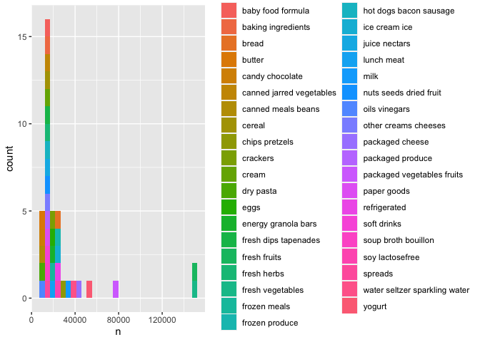

p8105_hw3_yc4384
================
Yangyang Chen
2023-10-06

## Problem_1

**1. Importing Data**

    ##  [1] "order_id"               "product_id"             "add_to_cart_order"     
    ##  [4] "reordered"              "user_id"                "eval_set"              
    ##  [7] "order_number"           "order_dow"              "order_hour_of_day"     
    ## [10] "days_since_prior_order" "product_name"           "aisle_id"              
    ## [13] "department_id"          "aisle"                  "department"

**2. Data Description**

- The dataset **instacart** is a 1384617 \* 15 dataframe. It contains
  1384617 observations and key variables are: order_number, order_dow,
  order_hour_of_day, days_since_prior_order, product_name, aisle_id,
  department_id, aisle, department. Dataset has the order records of
  each costumers, including *product name, order number, user id*, etc.

- There are **134** aisles, and **fresh vegetables** aisles are the most
  items ordered from.

``` r
instacart |> 
  group_by(aisle) |> 
  summarize(n = n()) |> 
  count()
```

    ## # A tibble: 1 × 1
    ##       n
    ##   <int>
    ## 1   134

``` r
instacart |> 
  group_by(aisle) |>
  summarize(n = n()) |> 
  mutate(n_ranking = min_rank(n)) |> 
  filter(n_ranking>133) 
```

    ## # A tibble: 1 × 3
    ##   aisle                 n n_ranking
    ##   <chr>             <int>     <int>
    ## 1 fresh vegetables 150609       134

- This plot shows **the number of items ordered in each aisle**, with
  limitation that to aisles with more than 10000 items ordered.

``` r
instacart |> 
  group_by(aisle) |>
  summarize(n = n()) |> 
  mutate(n_ranking = min_rank(n)) |> 
  filter(n>10000) |> 
  ggplot(aes(x = n, fill = aisle)) +
  geom_histogram()
```

    ## `stat_bin()` using `bins = 30`. Pick better value with `binwidth`.

<!-- -->

- This table shows **the three most popular items in each of the
  aisles** “baking ingredients”, “dog food care”, and “packaged
  vegetables fruits”.

``` r
instacart |> 
  group_by(aisle) |> 
  summarize(n = n()) |> 
  filter(aisle == "baking ingredients" | aisle == "dog food care" | aisle == "packaged vegetables fruits") |> 
  pivot_wider(
    names_from = aisle,
    values_from = n
  ) |> 
  knitr::kable()
```

| baking ingredients | dog food care | packaged vegetables fruits |
|-------------------:|--------------:|---------------------------:|
|              13088 |          1612 |                      78493 |

- This table shows **the mean hour of the day** at which Pink Lady
  Apples and Coffee Ice Cream are ordered on each day of the week.

``` r
instacart |> 
  group_by(product_name, order_dow) |> 
  summarize(mean_hour = mean(order_hour_of_day)) |> 
  filter(product_name == "Pink Lady Apples" | product_name == "Coffee Ice Cream" ) |> 
  pivot_wider(
    names_from = order_dow,
    values_from = mean_hour
  ) |> 
  knitr::kable()
```

    ## `summarise()` has grouped output by 'product_name'. You can override using the
    ## `.groups` argument.

| product_name     |        0 |        1 |        2 |        3 |        4 |        5 |        6 |
|:-----------------|---------:|---------:|---------:|---------:|---------:|---------:|---------:|
| Coffee Ice Cream | 13.77419 | 14.31579 | 15.38095 | 15.31818 | 15.21739 | 12.26316 | 13.83333 |
| Pink Lady Apples | 13.44118 | 11.36000 | 11.70213 | 14.25000 | 11.55172 | 12.78431 | 11.93750 |
