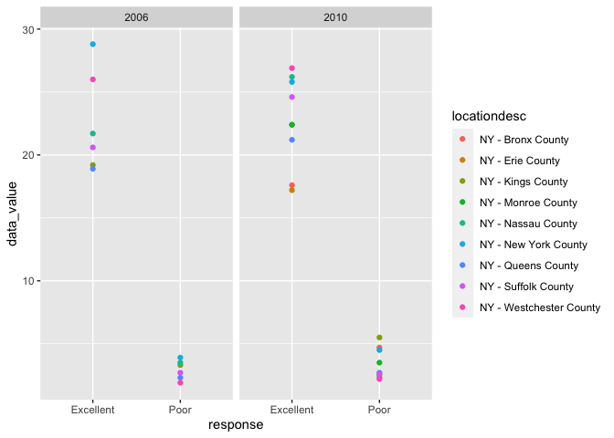

p8105_hw3_yc4384
================
Yangyang Chen
2023-10-07

## Problem_1

**1. Importing Data**

    ##  [1] "order_id"               "product_id"             "add_to_cart_order"     
    ##  [4] "reordered"              "user_id"                "eval_set"              
    ##  [7] "order_number"           "order_dow"              "order_hour_of_day"     
    ## [10] "days_since_prior_order" "product_name"           "aisle_id"              
    ## [13] "department_id"          "aisle"                  "department"

**2. Data Description**

- The dataset **instacart** is a 1384617 \* 15 dataframe. It contains
  1384617 observations and key variables are: order_number, order_dow,
  order_hour_of_day, days_since_prior_order, product_name, aisle_id,
  department_id, aisle, department. Dataset has the order records of
  each costumers, including *product name, order number, user id*, etc.

- There are **134** aisles, and **fresh vegetables** aisles are the most
  items ordered from:

``` r
instacart |> 
  group_by(aisle) |> 
  summarize(n = n()) |> 
  count()
```

    ## # A tibble: 1 × 1
    ##       n
    ##   <int>
    ## 1   134

``` r
instacart |> 
  group_by(aisle) |>
  summarize(n = n()) |> 
  mutate(n_ranking = min_rank(n)) |> 
  filter(n_ranking>133) 
```

    ## # A tibble: 1 × 3
    ##   aisle                 n n_ranking
    ##   <chr>             <int>     <int>
    ## 1 fresh vegetables 150609       134

- Following plot shows **the number of items ordered in each aisle**,
  with limitation that to aisles with more than 10000 items ordered:

``` r
instacart |> 
  group_by(aisle) |>
  summarize(n = n()) |> 
  mutate(n_ranking = min_rank(n)) |> 
  filter(n>10000) |> 
  ggplot(aes(x = n, fill = aisle)) +
  geom_histogram()
```

<!-- -->

- Following table shows **the three most popular items in each of the
  aisles** “baking ingredients”, “dog food care”, and “packaged
  vegetables fruits”:

``` r
instacart |> 
  group_by(aisle, product_name) |> 
  filter(aisle == "baking ingredients" | aisle == "dog food care" | aisle == "packaged vegetables fruits") |> 
  summarize(n = n()) |> 
  filter(min_rank(desc(n)) < 4) |> 
  knitr::kable()
```

| aisle                      | product_name                                  |    n |
|:---------------------------|:----------------------------------------------|-----:|
| baking ingredients         | Cane Sugar                                    |  336 |
| baking ingredients         | Light Brown Sugar                             |  499 |
| baking ingredients         | Pure Baking Soda                              |  387 |
| dog food care              | Organix Chicken & Brown Rice Recipe           |   28 |
| dog food care              | Small Dog Biscuits                            |   26 |
| dog food care              | Snack Sticks Chicken & Rice Recipe Dog Treats |   30 |
| packaged vegetables fruits | Organic Baby Spinach                          | 9784 |
| packaged vegetables fruits | Organic Blueberries                           | 4966 |
| packaged vegetables fruits | Organic Raspberries                           | 5546 |

- Following table shows the mean hour of the day\*\* at which Pink Lady
  Apples and Coffee Ice Cream are ordered on each day of the week:

``` r
instacart |> 
  group_by(product_name, order_dow) |> 
  summarize(mean_hour = mean(order_hour_of_day)) |> 
  filter(product_name == "Pink Lady Apples" | product_name == "Coffee Ice Cream" ) |> 
  pivot_wider(
    names_from = order_dow,
    values_from = mean_hour
  ) |> 
  knitr::kable()
```

| product_name     |        0 |        1 |        2 |        3 |        4 |        5 |        6 |
|:-----------------|---------:|---------:|---------:|---------:|---------:|---------:|---------:|
| Coffee Ice Cream | 13.77419 | 14.31579 | 15.38095 | 15.31818 | 15.21739 | 12.26316 | 13.83333 |
| Pink Lady Apples | 13.44118 | 11.36000 | 11.70213 | 14.25000 | 11.55172 | 12.78431 | 11.93750 |

## Problem 2

**1. Importing Data**

``` r
data("brfss_smart2010")
```

**2. Data cleaning:**

- Format the data to use appropriate variable names;

- Focus on the “Overall Health” topic;

- Include only responses from “Excellent” to “Poor”;

- Organize responses as a factor taking levels ordered from “Poor” to
  “Excellent”.

``` r
brfss_clean_df = 
  brfss_smart2010 |> 
  janitor::clean_names() |> 
  filter(topic == "Overall Health") |> 
  filter(response %in% c("Excellent", "Very good", "Good", "Fair", "Poor")) |> 
  mutate(response = factor(response, levels = c("Excellent", "Very good", "Good", "Fair", "Poor")))
```

- In **2002**, states **`MA, NJ and PA`** were observed at 7 or more
  locations:

``` r
brfss_clean_df |> 
  filter(year==2002) |> 
  group_by(locationabbr) |> 
  distinct(locationdesc) |> 
  summarize(n = n())|> 
  filter(n>7) 
```

    ## # A tibble: 3 × 2
    ##   locationabbr     n
    ##   <chr>        <int>
    ## 1 MA               8
    ## 2 NJ               8
    ## 3 PA              10

- In **2010**, states
  **`CA, FL, MA, MD, NC, NE, NJ, NY, OH, TX and WA`** were observed at 7
  or more locations:

``` r
brfss_clean_df |> 
  filter(year==2010) |> 
  group_by(locationabbr) |> 
  distinct(locationdesc) |> 
  summarize(n = n())|> 
  filter(n>7) 
```

    ## # A tibble: 11 × 2
    ##    locationabbr     n
    ##    <chr>        <int>
    ##  1 CA              12
    ##  2 FL              41
    ##  3 MA               9
    ##  4 MD              12
    ##  5 NC              12
    ##  6 NE              10
    ##  7 NJ              19
    ##  8 NY               9
    ##  9 OH               8
    ## 10 TX              16
    ## 11 WA              10

**brfss_exce_df:** dataset only includes Excellent responses, and
contains year, state, and a variable that averages the data_value across
locations within a state:

``` r
brfss_exce_df =
  brfss_clean_df |> 
  filter(response == "Excellent") |> 
  select(c(year, locationabbr, locationdesc, data_value)) |> 
  group_by(locationabbr, year) |> 
  mutate(data_value_mean = mean(data_value, na.rm = TRUE))
```

**Spaghetti plot:** average value over time within a state:

``` r
brfss_exce_df |> 
  ggplot(aes(x = year, y = data_value_mean, group = locationabbr, color = locationabbr)) +
  geom_line() 
```

<!-- -->

**Two-panel plot** shows for the years 2006, and 2010, distribution of
data_value for responses (“Poor” to “Excellent”) among locations in NY
State:

``` r
brfss_p_exce_df = 
  brfss_clean_df |> 
    filter(response %in% c("Excellent", "Poor")) |> 
    filter(year %in% c(2006, 2010)) |> 
    filter(locationabbr == "NY") |> 
    select(c(year, locationabbr, locationdesc, data_value, response)) |> 
    group_by(locationabbr, year) 

brfss_p_exce_df |>   
  ggplot(aes(x = response, y = data_value, color = locationdesc)) +
  geom_point() +
  facet_grid(. ~ year)
```

<!-- -->

## Problem 3

**1. Data cleaning and merging:**

- Dataset includes all originally observed variables;
- Exclude participants less than 21 years of age, and those with missing
  demographic data;
- Encode data with reasonable variable classes (i.e. not numeric, and
  using factors with the ordering of tables and plots in mind).

``` r
acc_df = 
  read_csv("data/nhanes_accel.csv") |> 
  janitor::clean_names()
cov_df = 
  read_csv("data/nhanes_covar.csv", skip = 4) |> 
  janitor::clean_names()
cov_clean_df =
  cov_df |>
  filter(age >= 21) |> 
  drop_na() |> 
  mutate(
    sex = 
      case_match(
        sex, 
        1 ~ "male", 
        2 ~ "female"),
    sex = as.factor(sex)) |> 
  mutate(
    education = 
      case_match(
        education, 
        1 ~ "Low", 
        2 ~ "Median",
        3 ~ "High"),
    education = as.factor(education)) 

mims_data = 
  left_join(cov_clean_df, acc_df, by = "seqn") 
```

**2. Data Visualization**

**Table**: the number of men and women in each education category.

``` r
mims_data |> 
  group_by(sex, education) |> 
  summarize(n = n()) |> 
  pivot_wider(
    names_from = sex,
    values_from = n
  ) |> 
  knitr::kable()
```

| education | female | male |
|:----------|-------:|-----:|
| High      |     59 |   56 |
| Low       |     28 |   27 |
| Median    |     23 |   35 |

**Comments:**

- More females have received high and low level education than male.

- More male have received median level education than female.

**Plot**: Create a visualization of the age distributions for men and
women in each education category.

``` r
mims_data |> 
  group_by(sex, education, age) |> 
  summarize(n = n()) |> 
  ggplot(aes(x = age, fill = education)) +
  geom_density(alpha = .4, adjust = .5, color = "blue") +
  facet_wrap(~ sex, nrow = 1)
```

<!-- -->
**Comments:**

- We can observe that female group received high education in age 60 -
  80; While male received more low education than female.
- Besides, female in each age interval received balanced education
  levels, and reaches education peak in high education; However, male
  reaches education peak in low level.

Traditional analyses of accelerometer data focus on the total activity
over the day. Using your tidied dataset, aggregate across minutes to
create a total activity variable for each participant. Plot these total
activities (y-axis) against age (x-axis); your plot should compare men
to women and have separate panels for each education level. Include a
trend line or a smooth to illustrate differences. Comment on your plot.

Accelerometer data allows the inspection activity over the course of the
day. Make a three-panel plot that shows the 24-hour activity time
courses for each education level and use color to indicate sex. Describe
in words any patterns or conclusions you can make based on this graph;
including smooth trends may help identify differences.
